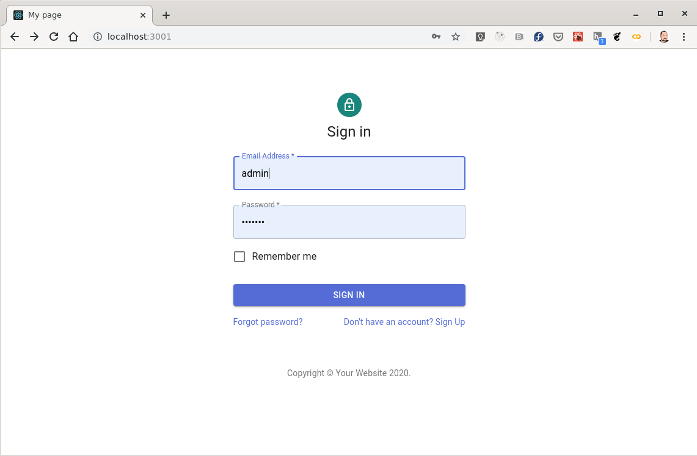
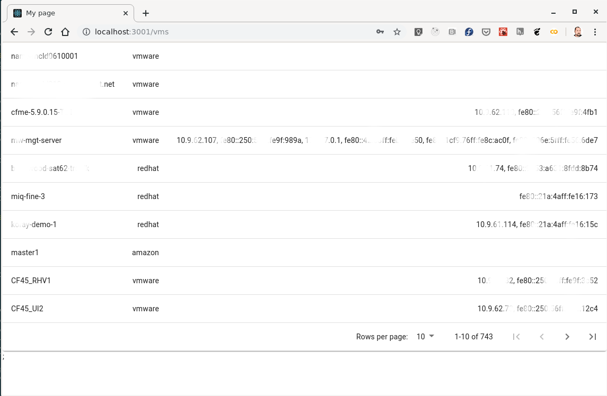

# ManageIQ starter app

A single page application running possibly on a separate (different) domain than the ManageIQ API consuming the ManageIQ API.

## Setting up Apache CORS

Use your appliance or download and run one from [https://www.manageiq.org/download/](https://www.manageiq.org/download/).

Edit `/etc/httpd/conf.d/manageiq-https-application.conf` on the appliance to include:


```
SetEnvIf Origin "^(.*)$" cors=$0
# wash out these headers in the 'onsuccess' table if we get them from the backend
Header onsuccess unset Access-Control-Allow-Origin env=cors
Header onsuccess unset Access-Control-Allow-Credentials env=cors
Header onsuccess unset Access-Control-Allow-Methods env=cors
Header onsuccess unset Access-Control-Allow-Headers env=cors
# add them to the 'always' table
Header always set Access-Control-Allow-Origin %{cors}e env=cors
Header always set Access-Control-Allow-Credentials "true" env=cors
Header always set Access-Control-Allow-Methods "POST, GET, OPTIONS, PUT, DELETE" env=cors
Header always set Access-Control-Allow-Headers "accept,x-requested-method,origin,authorization,x-auth-token" env=cors

```

We are unsetting the CORS headers and setting our own version.

Specifically adding:
  * 'Authorization' (HTTP basic auth) header and 
  * 'X-Auth-Tok' header (token based authentization for the ManageIQ API).

Then reload the apache: `service httpd reload`.

Alternatively you can run agains a local development environment. In that case you need to edit `manageiq/config/initializers/secure_headers.rb'.

## Run this app:

Download the example [or clone the repo](https://github.com/martinpovolny/miq-starter-app):

Edit `./src/config.js` and set the baseUrl to the ManageIQ API.

Install it and run:

```sh
npm install
npm start
```

## Screenshots




