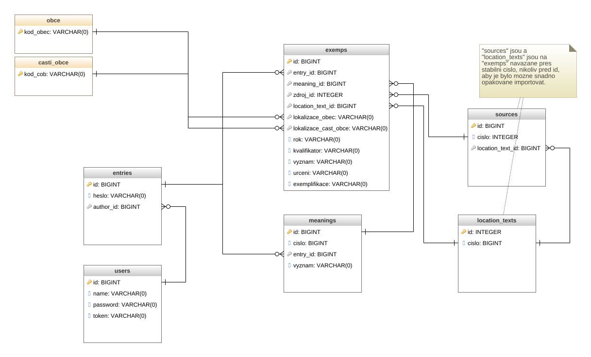

Aplikace se skládá z těchto 2 základních komponent:

 * API server.
 * Frontend.

Jako úložiště pro data je použita SQL databáze PostgreSQL. Data příloh jsou
uložena na souborovém systému serveru.

API i frontned jsou zpřístupněny se serveru prostředníctvím protokolu HTTPS s
certifikátem Let's encrypt (https://letsencrypt.org/).

Na serveru je provozován operační systém Ubuntu Linux.

## API server

API server je implementován v jazyce Ruby pomocí frameworku Ruby on Rails
(https://rubyonrails.org/).

API server komunikuje s SQL databází PostgreSQL a programem zajišťujícím export
do formátu DOCX.

Exporty do formátu DOCX jsou implementovány samostatným programem v jazyce
Python. Pomocí klihovny docx (https://python-docx.readthedocs.io/en/latest/).

## Frontend

Frontend (uživatelské rozhraní) je implementován v jazyce JavaScript jako SPA
(single page application) pomocí systému React (https://reactjs.org/). Používá
knihovnu komponent Material UI (https://material-ui.com/) .

Pro zobrazení náhledu lokalizace je použita služba mapy.cz společnosti Seznam.cz.

Fronetnd je kompatibilní se všemi rozšířenými prohlížeší, které jsou
podporovaný svými vyrobci (Chrome, Firefix, Edge, Safari, Opera a další.)

## Autentizace uživatelů

Autentizace uživatelů je prováděna proti seznamu uživatelů uloženému v databází
a pomocí protokolu OAuth2 poskytovatele identity společnosti Google
(https://developers.google.com/identity/protocols/oauth2).

## Databázové schéma

Databáze se skládá z tabulek, které zabespečují lokalizaci (okresy, obce, části
obce,...), částu pro modelování hesel a exemplifikací (hesla, významy,
exemplifikace,..) a dalších podpůrných částí (zdroje, uživatelé, ...).

## Zdrojové kody

Kompletní zdrojové kódy aplikace jsou hostované na platformě GitHub na adrese https://github.com/proponar.

